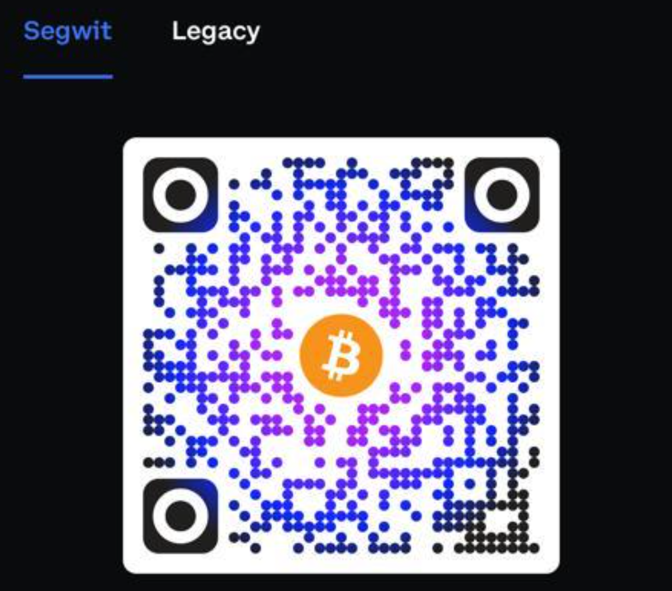
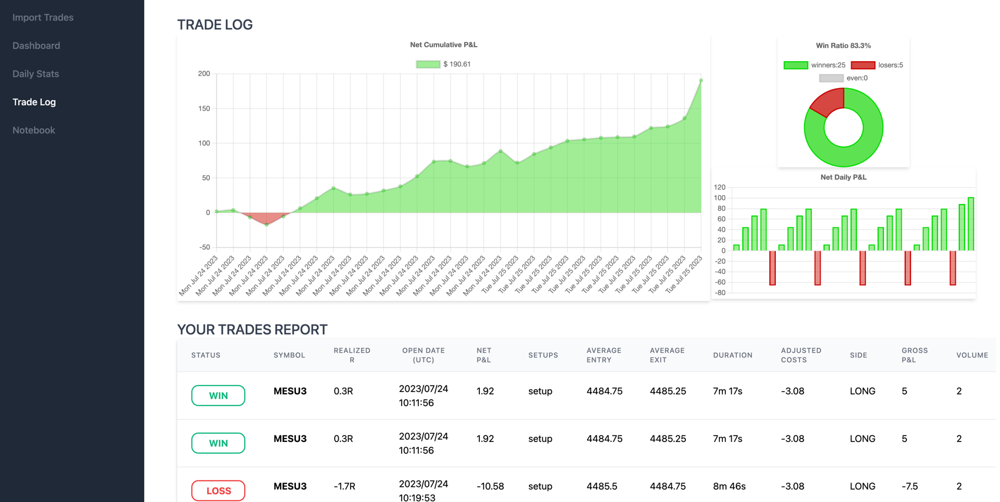
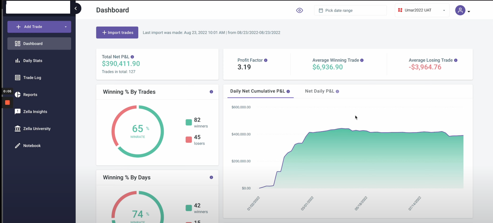
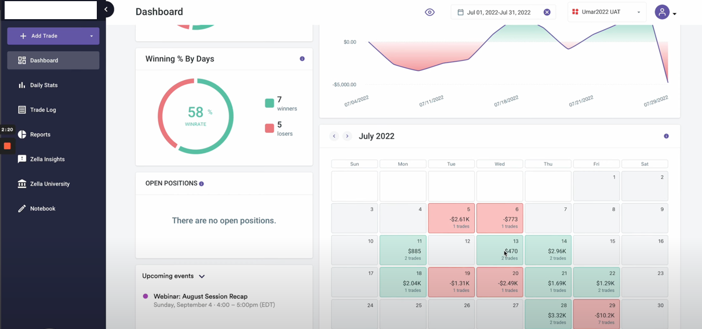
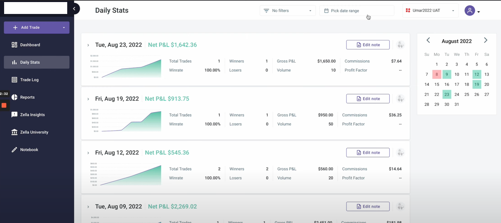
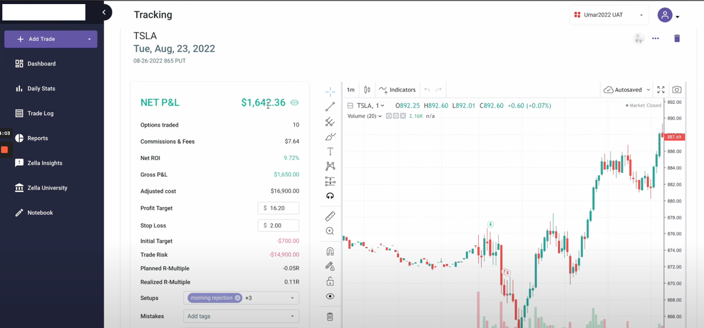
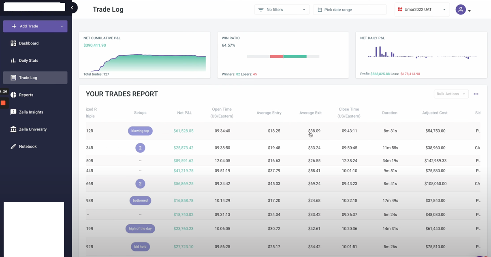

# PipPaper

### Elevating Trade Management and Journaling

Welcome to PipPaper, the platform that takes trade management and journaling to a new level of professionalism and organization.

Designed with the serious trader in mind, PipPaper provides a comprehensive solution for meticulously documenting and analyzing your trading activities.

PipPaper will be a standalone app free to use for every serious trader, just import your trading csv en get insights into your trading behaviour

The rationale behind this project is that the current SAAS solutions are pretty expensive, so I thought why not build a standalone version.

The stack will be quite simple

# Fresh project

Your new Fresh project is ready to go. You can follow the Fresh "Getting
Started" guide here: https://fresh.deno.dev/docs/getting-started

### Usage

Make sure to install Deno: https://deno.land/manual/getting_started/installation

Then start the project:

```
deno task start
```

This will watch the project directory and restart as necessary.

if you want to buy me a beer:



segwit: bc1q3lxkq3pmtqm2uyf63wqcg0354mpcrw63wxy2fz

# Current Status



work in progress but here are some idea' where it should be heading in the future!

If you have designs and nice functional additions just add the in the issues section

# Future Status

## Dashboard




## Daily Stats


## Trade


## Trade log


