# PipPaper

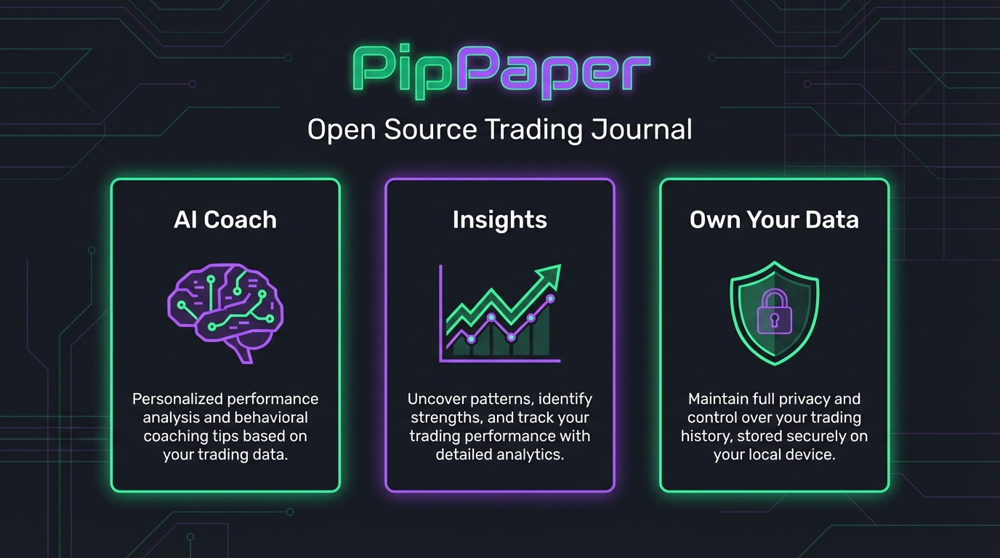

## AI Coach Analysis
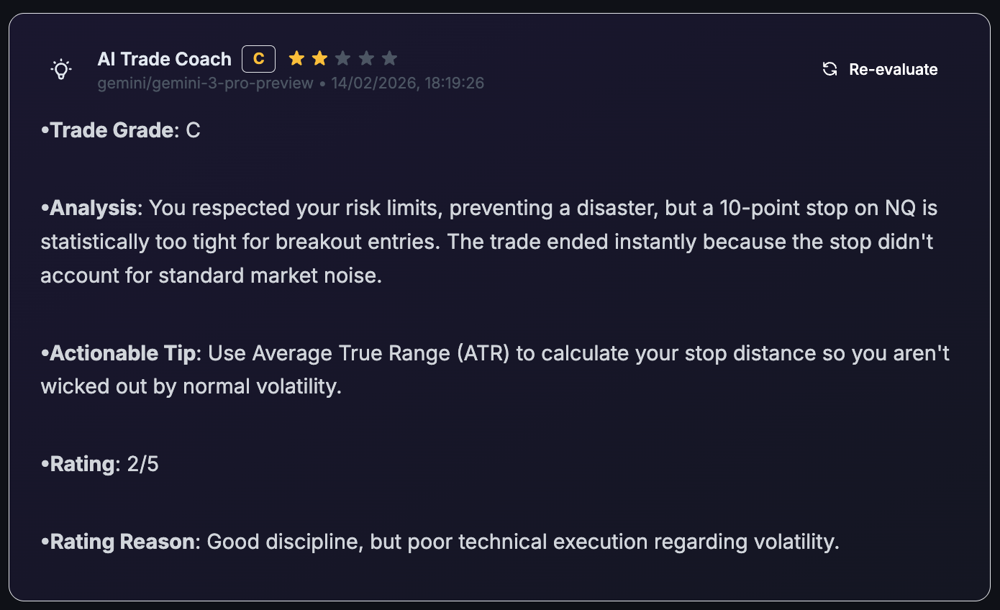

### The Open Source TradeZella Alternative

PipPaper is a comprehensive trade journaling and analysis platform designed to replicate the core functionality of premium tools like TradeZella, but open source and self-hosted. Built with Deno and Fresh, it provides advanced dashboards, trade logging, AI coaching, and more — all running locally so your data never leaves your machine.

---

## Screenshots

### Dashboard
Full overview with KPI cards (Total P&L, Win Rate, Profit Factor, etc.), equity curve, daily P&L chart, win ratio donut, performance calendar, and win/loss streaks.

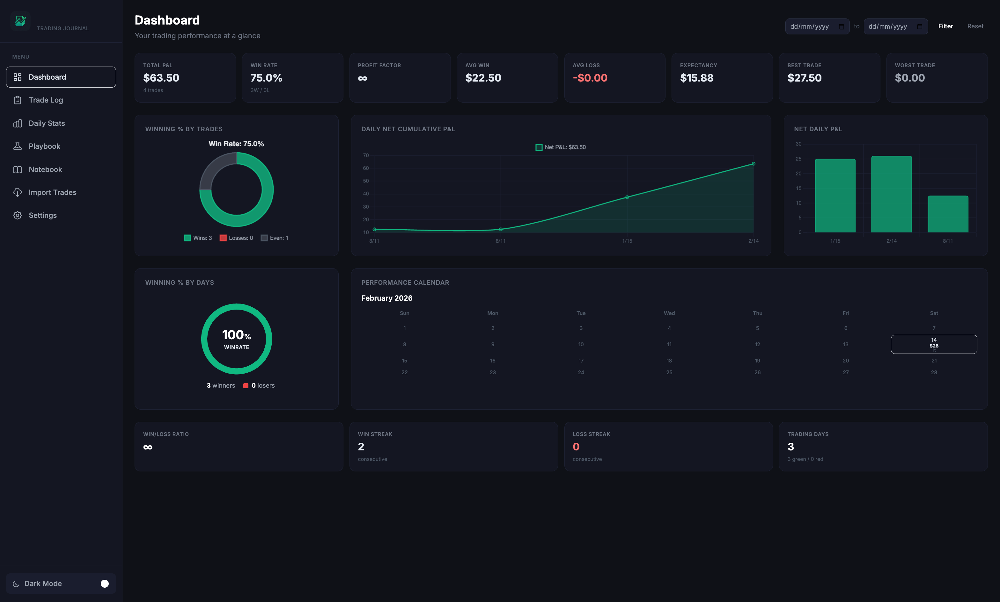

### Trade Log
All trades in a searchable, filterable table with summary cards. Filter by symbol, status (Win/Loss/Even), broker, setup, and date range. Paginated with 25/50/100 rows per page.

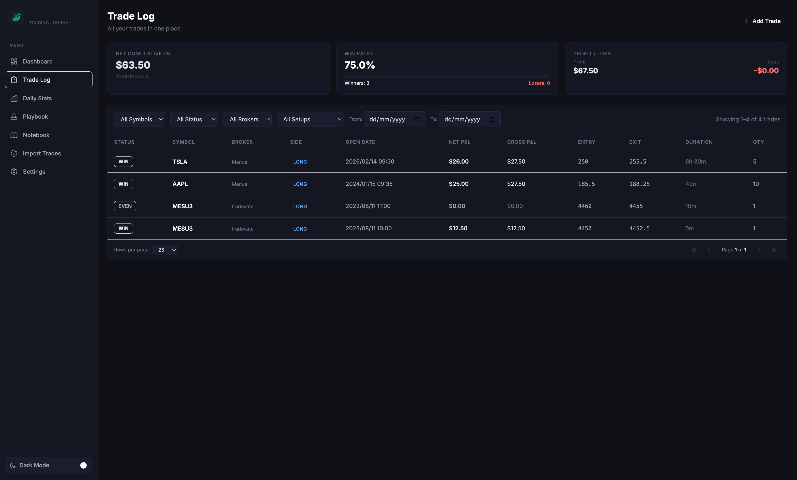

### Add Manual Trade
Modal form to manually add trades with symbol, side, entry/exit prices, quantity, P&L, commission, dates, stop loss, and profit target.

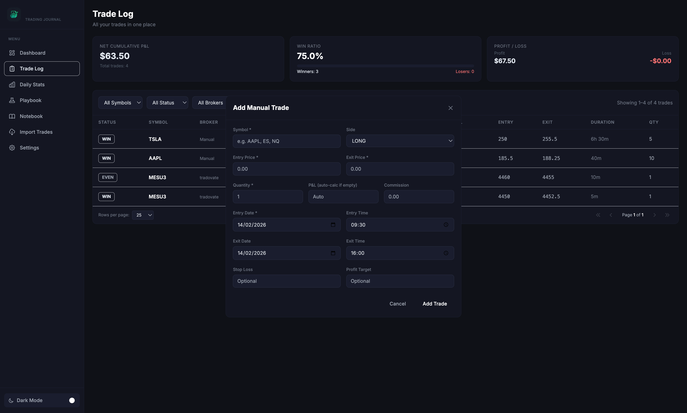

### Trade Detail & Chart
Full trade view with **custom candlestick charts** (powered by Yahoo Finance data), execution details, trade analysis, and rich text journal.
Includes **AI Trade Coach** integration for instant feedback.

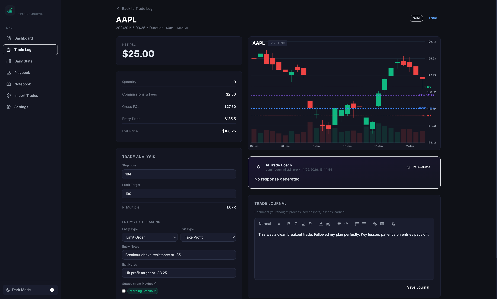

### Daily Stats
Performance breakdown by day, symbol, and hour of day. Includes day-by-day table showing trade count, P&L, and green/red day classification.

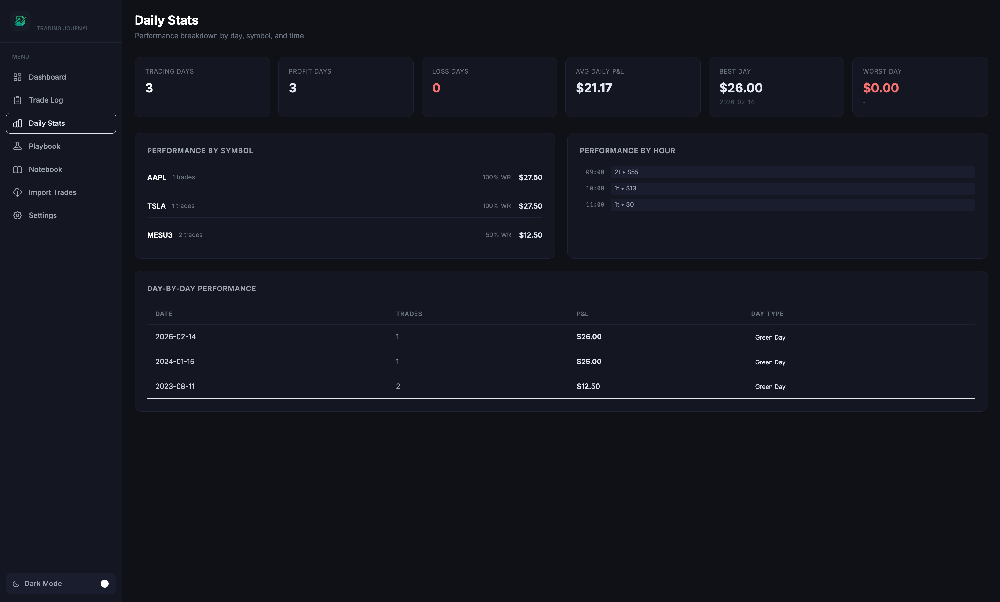

### Playbook
Define trading setups with descriptions, entry/exit rules, and color-coded tags. Track performance stats (win rate, net P&L) per setup automatically.

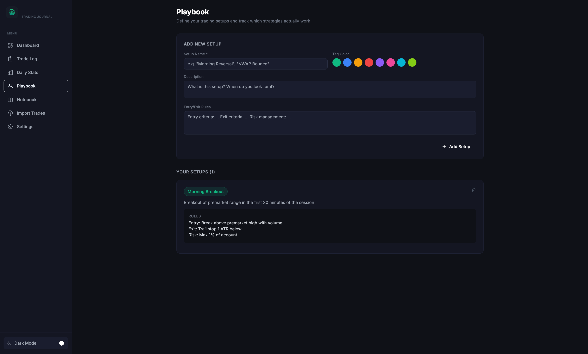

### Notebook
Daily trade plan editor and free-form journal with a rich text editor (bold, italic, lists, code blocks, links, images). Past entries displayed chronologically.

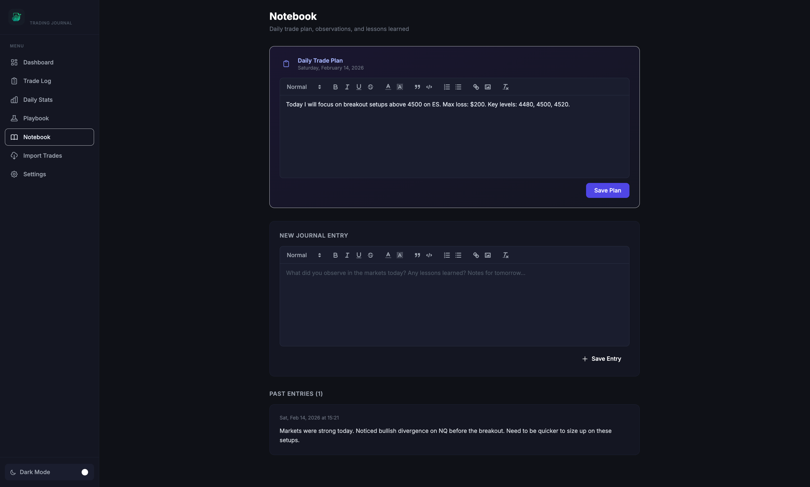

### Import Trades
Upload Tradovate CSV exports with drag-and-drop. Supported brokers listed with roadmap for NinjaTrader, MetaTrader, and Interactive Brokers.

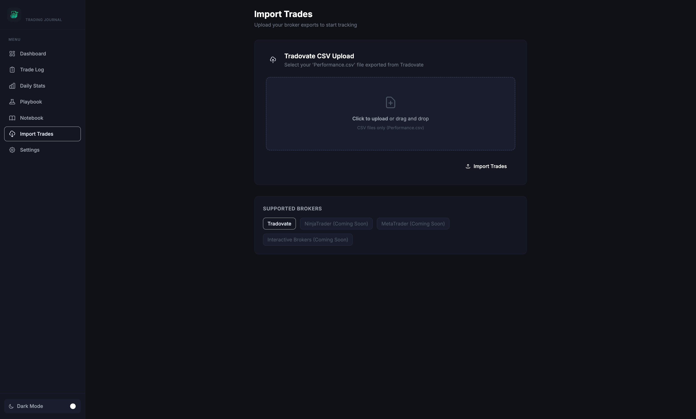

### Settings — Custom Tags
Create and manage custom tags by category (Mistake, Setup, General) with color coding. Tags are used for trade analysis and filtering.

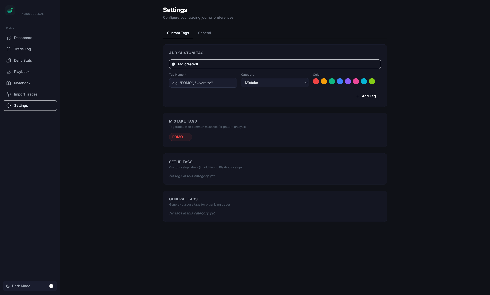

### Settings — General & AI Model
Configure **AI Model** (dynamically discovered from Google Gemini API), manage data, and backup/restore your entire journal via zipped JSON export.

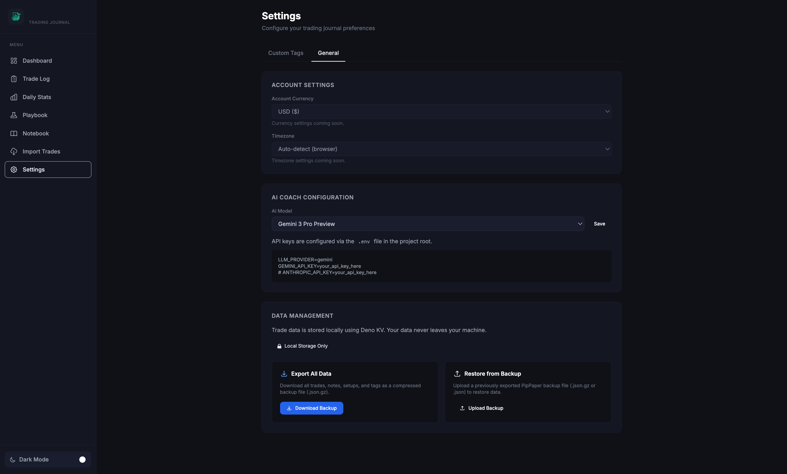

### Light Mode
Full light/dark theme toggle via the sidebar. Preference is persisted in localStorage.

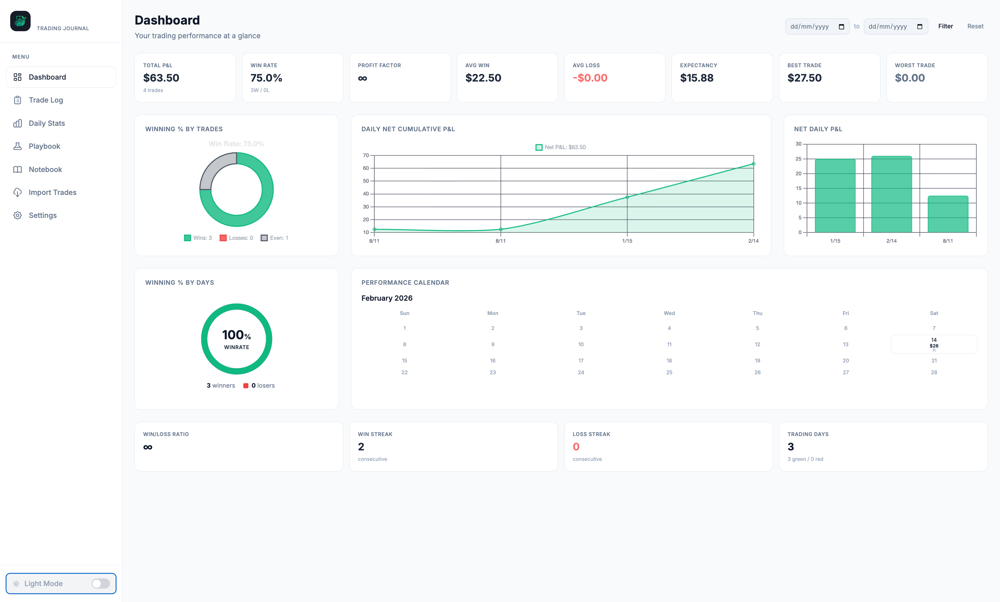

---

## Key Features

- **Dashboard** — Total P&L, Win Rate, Profit Factor, Expectancy, Equity Curve, Daily P&L chart, Win/Loss donut charts, Performance Calendar, Win/Loss streaks
- **Trade Log** — Full trade table with filtering (symbol, status, broker, setup, date range), pagination (25/50/100), click-through to trade detail
- **Interactive Charts** — Canvas-based candlestick charts with volume, entry/exit markers, and auto-fetched kline data (1m/5m/1d intervals) from Yahoo Finance. Data is cached locally.
- **AI Trade Coach** — Instant trade analysis using Google Gemini models (dynamically discovered). Provides feedback on execution, risk management, and psychology, plus a **1-5 star rating** with reasoning.
- **Trade Detail** — Execution details, R-multiple calculation, entry/exit reason tracking, setup & mistake tagging, rich text trade journal
- **Add Manual Trade** — Full modal form for manual trade entry with auto-calculated P&L
- **Daily Stats** — Performance by day, symbol, and hour of day with day-by-day table
- **Playbook** — Define trading setups with rules, track per-setup performance automatically
- **Notebook** — Daily trade plan + free-form journal with rich text editor (Quill)
- **Import** — Tradovate CSV import with automatic trade parsing
- **Backup & Restore** — Full export/import of all data (trades, notes, settings) to zipped JSON
- **Settings** — Custom tag management (Mistake/Setup/General), AI Coach config, account settings
- **Dark/Light Theme** — Full theme toggle persisted in localStorage
- **Mobile Responsive** — Collapsible sidebar with hamburger menu
- **Privacy First** — All data stored locally via Deno KV, never leaves your machine

---

## Getting Started

### Prerequisites

- [Deno](https://deno.land/) v1.40+

### Quick Start (macOS / Linux)

```bash
git clone https://github.com/DennisRutjes/PipPaper.git
cd PipPaper
chmod +x start.sh
./start.sh
```

### Quick Start (Windows)

```cmd
git clone https://github.com/DennisRutjes/PipPaper.git
cd PipPaper
start.bat
```

The start scripts will:
1. Check if Deno is installed (install it automatically if missing)
2. Create a `.env` file from `.env.example` if one doesn't exist
3. Start the development server at **http://localhost:8000**

### Manual Start

```bash
# Install dependencies and start dev server
deno task start
```

### Configure AI Coach

PipPaper supports two AI providers for the Trade Coach: **Google Gemini** (cloud) or **Ollama** (local). Set `LLM_PROVIDER` in `.env` to choose.

#### Option 1: Google Gemini (cloud, default)

1. Get an API key from [Google AI Studio](https://aistudio.google.com/apikey).
2. Open `.env` and set:

```env
LLM_PROVIDER=gemini
GEMINI_API_KEY=your_key_here
```

3. Go to **Settings > General** to pick a model (e.g. Gemini 1.5 Pro, Gemini 1.5 Flash). The list is discovered dynamically from your API key.

#### Option 2: Ollama (local, fully private)

For a 100% offline setup, use [Ollama](https://ollama.com/) to run an LLM locally. No API key required.

1. [Install Ollama](https://ollama.com/download) and start the service (`ollama serve` or launch the desktop app).
2. Pull a model. `gemma4` is the default, but any Ollama-compatible model works:

```bash
ollama pull gemma4      # default
# or any other model:
ollama pull llama3.1
ollama pull qwen2.5
```

3. Open `.env` and switch the provider:

```env
LLM_PROVIDER=ollama

# Optional — defaults shown below
OLLAMA_BASE_URL=http://localhost:11434   # Ollama server URL
OLLAMA_MODEL=gemma4                      # model name (must match `ollama pull`)
```

| Variable | Required | Default | Description |
|----------|----------|---------|-------------|
| `LLM_PROVIDER` | yes | `gemini` | `gemini` or `ollama` |
| `OLLAMA_BASE_URL` | no | `http://localhost:11434` | Ollama API base URL |
| `OLLAMA_MODEL` | no | `gemma4` | Model tag (must be pulled via `ollama pull <tag>`) |
| `GEMINI_API_KEY` | gemini only | — | Google AI Studio API key |

> **Note:** The Ollama provider sends a text-only prompt, so chart images are ignored. Gemini receives the chart screenshot alongside the prompt for richer feedback. The coach rates trades on execution quality (1–5 stars, A+ to F grade), not raw P&L.

---

## Tech Stack

| Layer | Technology |
|-------|-----------|
| Runtime | [Deno](https://deno.land/) |
| Framework | [Fresh](https://fresh.deno.dev/) (Preact-based SSR) |
| Styling | Tailwind CSS via [Twind](https://twind.dev/) |
| Database | [Deno KV](https://deno.com/kv) (local, zero-config) |
| Charts | Canvas API + [Fresh Charts](https://deno.land/x/fresh_charts) |
| Rich Editor | [Quill](https://quilljs.com/) |
| AI | Google Gemini (cloud) or [Ollama](https://ollama.com/) (local) |

---

## Roadmap

- [x] Dashboard (P&L, Win Rate, Equity Curve, Calendar)
- [x] Trade Log with filtering and pagination
- [x] Trade Detail with Canvas Candlestick Chart
- [x] Manual trade entry
- [x] Tradovate CSV Import
- [x] AI Coach Integration (Dynamic Gemini Models)
- [x] Playbook (trading setups with performance tracking)
- [x] Notebook (daily plan + journal)
- [x] Settings (custom tags, general config, AI model selector)
- [x] Backup & Restore (Export/Import)
- [x] Dark/Light theme toggle
- [x] Mobile responsive layout
- [ ] Symbol mapping configuration
- [ ] NinjaTrader / MetaTrader / IBKR import
- [ ] Multi-account support

---

## License

MIT
